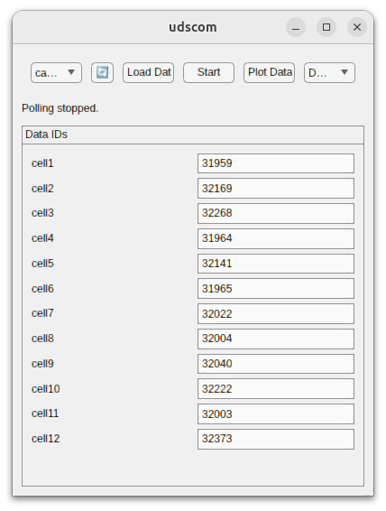

# udscom GUI

This repository contains a MATLAB application (`udscom_gui.m`) that provides a cross-platform ISO-TP communication interface for PC (Windows and Linux). It enables loading data lists, reading diagnostic information over CAN, and displaying results in a polling loop. 

## Preview


## Contents
```.
├── README.md # This file (overview and usage instructions)
├── udscom_gui.m # Main MATLAB GUI script
├── LICENSE.md
├── linux # Linux-specific scripts or libraries/
│   ├── isotp_mex_linux.cpp # Linux ISO-TP MEX interface 
│   └── isotp_mex_linux.mexa64 # Compiled binary (MATLAB R2024b)
└── windows # Windows-specific scripts or libraries/
    ├── CANInterface_Windows.m # Windows-specific CAN interface logic (PCANBasic, PCAN-ISO-TP)
    ├── PCANBasic.dll
    ├── PCANBasic.h
    ├── PCAN-ISO-TP_2016.h
    ├── PCAN-ISO-TP.dll
    ├── PCAN-UDS_2013.h
    └── PCAN-UDS.dll
```

## Requirements

1. **MATLAB 2020a or newer**  
   - The GUI uses `uifigure`, `uigridlayout`, and other App Designer-style components.
2. **PCANBasic.dll (Windows)**  
   - Required for basic CAN operations using the PCAN interface.
3. **PCAN-ISO-TP.dll / PCAN-UDS.dll (Windows)**  
   - Required if you need higher-level ISO-TP or UDS functionality on Windows.
4. **SocketCAN** (Linux)  
   - For Linux, the application uses SocketCAN (`ip link show canX`). 
5. **MATLAB Compiler (optional)**  
   - If you plan to distribute as a standalone application.
6. **PEAK CAN USB interface**
   - The application uses the PCAN driver libraries.

## Usage

1. **Clone or download** this repository.
2. **Open MATLAB** and navigate to the repository folder.
3. **Run `udscom_gui.m`** 
4. **Select the CAN interface** 
   - On Linux, you should see available SocketCAN interfaces (e.g., can0, can1).
   - On Windows, the application uses PCAN. CANInterface_Windows detects interfaces such as PCAN_USBBUS1.

5. **Load Data File**
   - Click “Load Data File” in the GUI to load a .txt file containing the IDs, labels, and data types.

6. **Start Polling**
   - Click “Start” to begin polling the loaded data IDs. The application displays parsed values in the UI.

7. **Adjust Display Mode**
   - Use the dropdown to select how numeric values are represented (Decimal, Hexadecimal, Binary).

8. **Stop Polling**
   - Click “Stop” to terminate the polling loop.

## File Descriptions

-   **`udscom_gui.m`**  
    Main script that builds the MATLAB GUI using `uifigure` and `uigridlayout`. Handles user interactions (loading data file, starting/stopping polling, display mode selection).
-   **`CANInterface_Windows.m`**  
    Contains Windows-specific code to initialize, read, and write CAN frames via PCANBasic or ISO-TP libraries.
    -   `tranceiveCAN_ISOTP_windows`: Uses ISO-TP for multi-frame messages.
    -   `detect`: Lists available PCAN channels.
    -   `cleanup`: Unloads libraries if needed.
-   **`isotp_mex_linux.*`**  
    (If present) Contains compiled MEX interface or scripts for SocketCAN ISO-TP operations on Linux.

## Customizing

-   **Adjust Baud Rates:**  
    If you need different CAN speeds, edit the code where you call `CAN_Initialize` (Windows) or `ip link set can0 up type ...` (Linux).
-   **Change Monospaced Font:**  
    You can specify `'FontName','FixedWidth'` in your UI fields to ensure alignment of binary/hex data.
-   **Add Support for More Data Types:**  
    Modify the `parsePayload` logic to handle custom data types (e.g., `uint8`, `uint64`, arrays).

## Contributing

1.  **Fork** this repository.
2.  **Create a branch** for your feature or fix.
3.  **Commit** your changes with clear messages.
4.  **Push** to your branch and **create a Pull Request**.


## License

[LICENSE](LICENSE.md)
